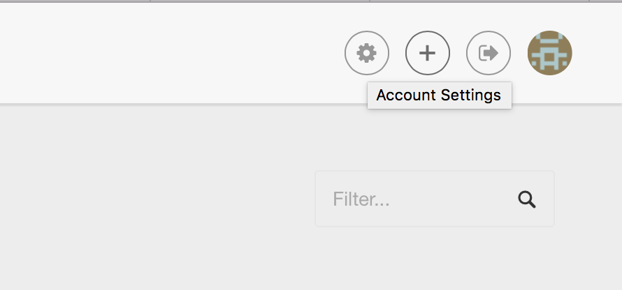
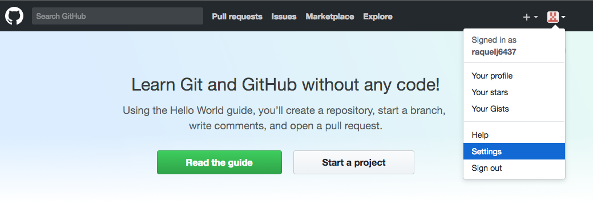
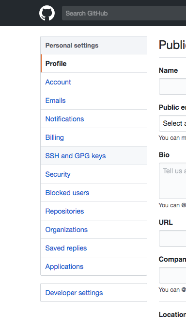

# GitHub Tutorial

_by Raquel Joseph_

---
## Git vs. GitHub
Git is version control which allows you to take snapshots of your code. Git does not require github.  
Github is an online cloud that stores your code, visually tracks your changes, easier way to collaborate on files, and requires git.

---
## Initial Setup
An SSH Key is a link between your local and external repository so that you wouldnt have to log in every time you push.

##### Finding an SSH Key
Open Cloud9
1. Go to settings  

2. go to SSH Keys  
  
**Copy second SSH Key**

Open Github  
1. Go to settings  
  
2. go to SSH and GPG keys  
  
On the top right corner, you should see New SHH Key in green. Click it!
**Paste second SSH Key**

In your command line type `ssh -T git@github.com`  

After you should see
`Hi <your username>! You've successfully authenticated, but GitHub does not provide shell access.`

---
## Repository Setup
**Github Set Up**
1. Create a Github account
2. Create a new repository named [folder name]

**Cloud 9 Set Up**
1. Open c9
2. You should see your terminal which looks like this
3. Now you need to create a folder  
    * use `mkdir <folder name>`
4. cd into <folder name>
    * `cd <folder name>`
5. Then type `git init` to initialize git
6. Create a README.md
7. Add text into the file
8. Type `git add .` into the command line
9. Type `git commit -m "add readme"` into the command line  
10. Now you have to connect your internal and external repositories  
    
    * Go back to your repo on github
    * Copy the code under the title "...push an existing..."
    * Paste it into your command line
11. Do steps 7-9 again
12. Type `git push` into the command line

---
## Workflow & Commands
#### Status
What is `git status`?  
`git status` is used to see which files are staged to be committed.

#### Add
What is `git add`?  
`git add` is used to add files to the stage. You use `git add .` to add all files to the stage to be committed. You use `git add --all` to add all **renamed or deleted files** to the stage to be committed.

#### Commit
What is `git commit`?  
`git commit -m ""` takes a snapshot of the files on the stage. You must use a quote and the quote is a message for your current commit which is present tense.

#### Push
What is `git push`?  
`git push` sends commits from you local repository to your remote repository.   

If you did not set up a connection between your local and external repositories you must do this before you use `git push`.  
* You have to use the command `git add remote origin URL`. This Sets up connection between local (existing) and remote (external) repository. Add add remote repository. Origin is the nickname for the remote repo. Url is the location of your github repository. 
* After, you have to tell your command line where to push to using the command `git push -u origin master`. You are telling your command line to always push to your remote and master branch.

---
## Rolling Back Changes
### Undo Edit
Oh no, you made an edit that you need gone but you cant remember what you changed. Type `git status`. Read what it says. It should tell you to use `git checkout -- <file>...`. This command undo's any edit you made to the file that you changed.
### Undo Add
Now add your file using `git add .`. When you type `git status` it should be green. If you type git status again, it should tell you how to un-add a file. Read what it says. To un-add you should type `git reset HEAD <file>...` to unstage your file.
### Undo Commit
To keep the changes you made but you want to undo the commit you use the command `git reset --soft HEAD^`. To delete changed and undo the commit you use `git reset --hard HEAD^`. You can also use `git reset --soft HEAD~2` which goes back two commits.  
### Undo Push
To undo a push you type `git log` which shows you a log of your previous commits. There will you see the SHA key of your commit. Then you can revert which undo's your push.
